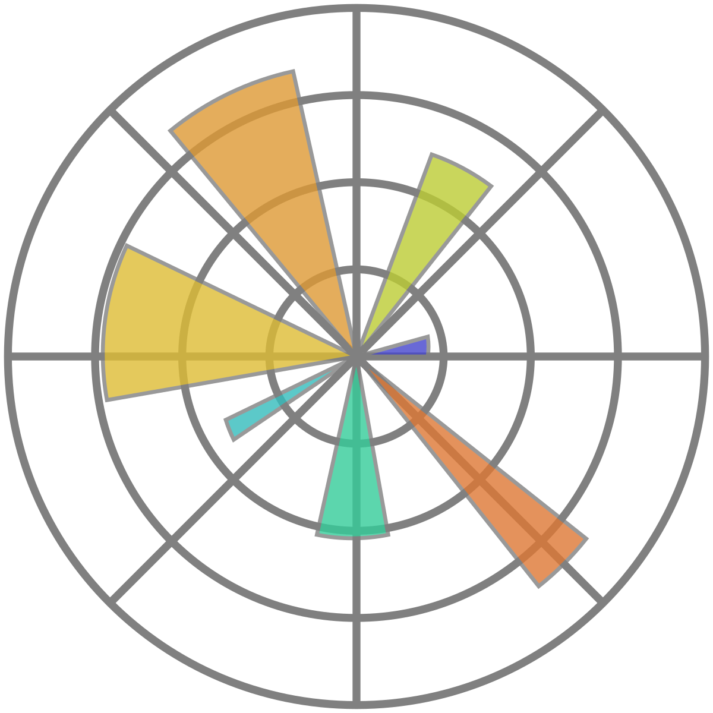

# Brandon Yee

### About Me

I’m Brandon Yee, a Chinese American Sophomore at Weston High School. Ever since my childhood, I have had a yearning to solve problems; whether it was the allure of the Rubix Cube or the difficulty in fixing an issue on my computer, I have always enjoyed spending countless hours fixing my own issues. Coding and software engineering is my medium to do so as a career; with coding, I can not only solve my own problems but also create solutions to problems bigger than myself and give back to the world. I want to pursue software engineering in college and combine this passion with my passion for finance to dual-major in computer science and finance.

---
### 🧰 Languages and Operating Systems

 

#

### 📚 Libraries 

 

#

### 🔧 Hosting Services and Tools

 

#

### 📊 Stats

